# Model Card: CNN Architectures for Fashion-MNIST Classification

This document details a series of experiments conducted as part of the "Trabalho Final - Parte 1", focusing on the classification of the Fashion-MNIST dataset. The project's core objective is to implement, evaluate, and compare several Convolutional Neural Network (CNN) architectures, systematically exploring the impact of design choices on model performance.

A key part of this project was the development of a flexible and reusable framework, consisting of the `ModelFlow` pipeline and the `GerenicCNN` builder, to accelerate and standardize the experimentation process.

The project adheres to the assignment's requirements by:

- Implementing a specified **Base Model** architecture.
- Exploring **variations** of the model's feature capacity (`n_feature`) and convolutional depth (adding blocks).
- Designing and testing custom **"Your Model"** architectures using a generic builder.
- Utilizing provided helper classes and evaluation metrics, including the **confusion matrix**.
- Employing **PyTorch Hooks** to investigate and visualize intermediate layer outputs.

## Data: Fashion-MNIST

This project uses the **Fashion-MNIST** dataset, a well-established benchmark for computer vision tasks. It was created by Zalando Research as a more challenging drop-in replacement for the original MNIST handwritten digit dataset.

- **Content**: The dataset consists of 70,000 grayscale images.
  - **Training Set**: 60,000 examples.
  - **Test Set**: 10,000 examples.
- **Dimensions**: Each image is 28x28 pixels with a single color channel.
- **Classes**: There are 10 balanced classes representing different articles of clothing:
  - 0: T-shirt/top, 1: Trouser, 2: Pullover, 3: Dress, 4: Coat, 5: Sandal, 6: Shirt, 7: Sneaker, 8: Bag, 9: Ankle boot.
- **Preprocessing**: To ensure model stability and faster convergence, the data is normalized. The mean (0.2860) and standard deviation (0.3530) were calculated _only_ from the training set and then applied to both the training and test sets.

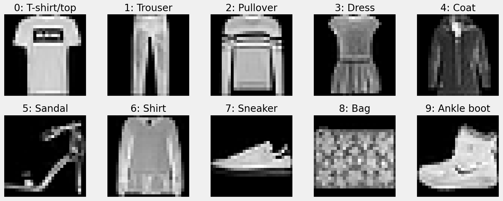

### Base Model

The foundational architecture for this project is the "Modelo Base" specified in the assignment proposal. It is a classic CNN structure composed of a feature extractor and a classifier.

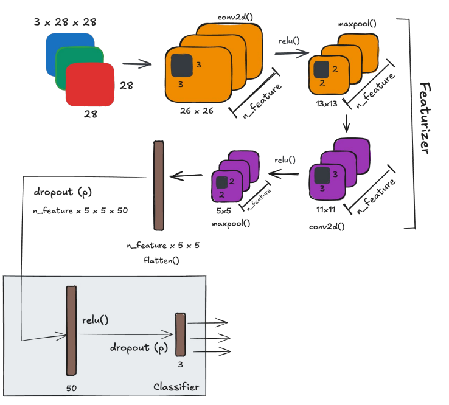

This architecture consists of:

1.  **Two convolutional blocks**: Each block contains a `Conv2D` layer, a `ReLU` activation function, and a `MaxPool2D` layer.
2.  **A classifier head**: This consists of a `Flatten` operation followed by two fully-connected (Linear) layers, with `ReLU` activation and `Dropout` for regularization.

## A Flexible Framework for Experimentation

To efficiently conduct these experiments, a modular framework was developed, separating the model definition from the training and evaluation pipeline.

### The `ModelFlow` Pipeline

The `ModelFlow` class is a reusable pipeline designed to handle the entire lifecycle of a model's training and evaluation. Its primary responsibility is to automate the experimental process, ensuring consistency across different runs.

Key functions include:

- **Initialization**: Takes a PyTorch model, data loaders, and an optimizer as input.
- **Training**: Manages the training loop for a specified number of epochs.
- **Evaluation**: Automatically calculates performance on the validation set.
- **Artifact Generation**: After training, it systematically generates and saves all essential results to a dedicated directory (`results/{model_name}/`), including:
  - `losses.png`: A plot of training and validation loss over epochs.
  - `confusion_matrix.png`: A normalized confusion matrix.
  - `classification_report.csv`: A detailed report with precision, recall, and F1-score per class.
  - `model_checkpoint.pth`: The saved state of the trained model for inference or further training.
  - Visualizations from hooks (filters and activations).

### The `GerenicCNN` Builder

The `GerenicCNN` class provides a powerful and flexible way to dynamically build diverse CNN architectures without writing a new class for each experiment. It is instantiated with parameters that define the network's structure, such as the number of convolutional and fully-connected layers, feature map sizes, and kernel sizes.

A key feature of this class is its **built-in validation logic**. Before building the model, it calculates the output dimensions of each convolutional and pooling layer. This proactive check prevents the creation of invalid architectures (e.g., where a pooling layer would reduce a feature map to a non-positive size) and provides a clear, printed trace of the tensor transformations for easy debugging.

```python
import math

class GerenicCNN(nn.Module):
    def __init__(self,
                 in_channels,
                 num_classes,
                 input_size=28,
                 amnt_cov_layers=2,
                 cov_kernel_sizes=None,
                 cov_features=None,
                 max_pool_sizes=None,
                 amnt_fc_layers=2,
                 fc_sizes=None,
                 p=0.3):
        super(GerenicCNN, self).__init__()

        # --- Default initializations and validation ---
        # ...

        self.conv_layers = nn.ModuleList()
        self.max_pool_layers = nn.ModuleList()

        current_channels = in_channels
        current_size = input_size
        for i in range(amnt_cov_layers):
            # --- Check if model is buildable ---
            if current_size <= 1:
                raise ValueError(f"Cannot create conv layer {i}, input size is too small.")

            # --- Dynamically create conv and pool layers ---
            self.conv_layers.append(...)
            self.max_pool_layers.append(...)

            # --- Calculate and print output dimensions ---
            _, current_size = self._compute_next_dims(current_size, cov_kernel_sizes[i], max_pool_sizes[i])
            print(f"conv{i} output size (after max pool): {current_size}x{current_size}")

        # --- Dynamically create fully-connected layers ---
        # ...

    def _compute_next_dims(self, current_dim, kernel_size, max_pool_size):
        # Calculates [(W - K + 2P)/S] + 1 for convolution and pooling
        conv_dim = (current_dim - kernel_size) + 1
        after_pool_dim = math.floor(conv_dim / max_pool_size)
        return conv_dim, after_pool_dim

    def forward(self, x):
        # --- Apply all conv and fc layers ---
        # ...
        return x
```

## Architectural Exploration & Results

The framework described above was used to train seven models, exploring different architectural trade-offs to address the assignment tasks.

### Task 1: Base Model & `n_feature` Variations

Three models were trained using a fixed 2-conv-layer architecture, varying only the number of feature maps (`n_feature`). Increasing `n_feature` from 3 to 7 generally improved performance by giving the model more capacity to learn features.

|              `cnn2_3` (Accuracy: 80.41%)              |              `cnn2_5` (Accuracy: 83.28%)              |              `cnn2_7` (Accuracy: 84.96%)              |
| :---------------------------------------------------: | :---------------------------------------------------: | :---------------------------------------------------: |
| 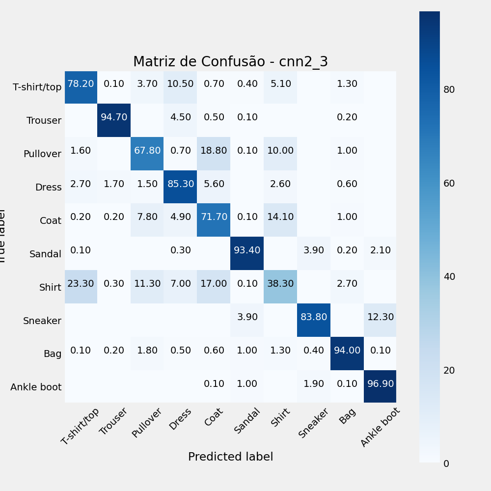 | 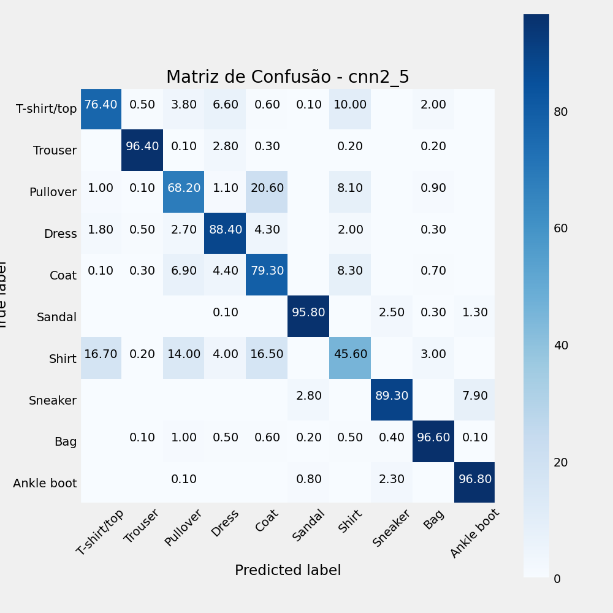 | 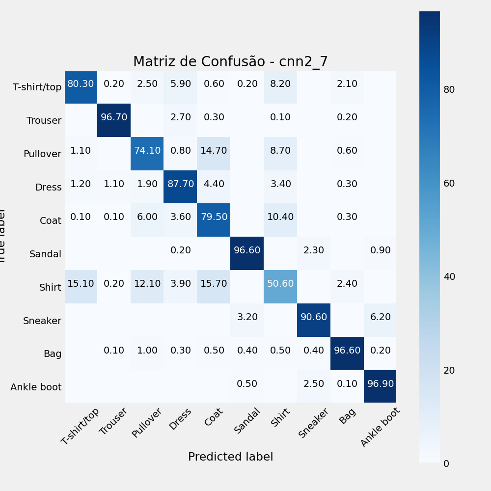 |

### Task 2: Custom Architectures

The `GerenicCNN` builder was then used to create more diverse architectures.

- **`generic_1` (Deeper)**: A model with **3 convolutional blocks**.

```json
// Rede mais profunda
{
  "in_channels": 1,
  "num_classes": 10,
  "input_size": 28,
  "amnt_cov_layers": 3,
  "cov_kernel_sizes": [3, 3, 3],
  "cov_features": [8, 16, 32],
  "max_pool_sizes": [2, 2, 2],
  "amnt_fc_layers": 3,
  "fc_sizes": [100, 50],
  "p": 0.3
}
```

- **`generic_2` (Simpler)**: A custom model with only **1 convolutional block**.

```json
// Rede Pequena
{
  "in_channels": 1,
  "num_classes": 10,
  "input_size": 28,
  "amnt_cov_layers": 1,
  "cov_kernel_sizes": [5],
  "cov_features": [4],
  "max_pool_sizes": [2],
  "amnt_fc_layers": 2,
  "fc_sizes": [20],
  "p": 0.3
}
```

- **`generic_3` (Deep Classifier)**: A custom model with a **10-layer** fully-connected head.

```json
// Rede Muitos FC
{
	"in_channels": 1,
	"num_classes": 10,
	"input_size": 28,
	"amnt_cov_layers": 2,
	"cov_kernel_sizes": [3, 3],
	"cov_features": [5, 5],
	"max_pool_sizes": [2, 2],
	"amnt_fc_layers": 10,
	"fc_sizes": [int(1024 + i * (25 - 1024) / (9 - 1)) for i in range(9)],
	"p": 0.3
},
```

|               `generic_1` (Accuracy: 82.45%)                |               `generic_2` (Accuracy: 87.46%)                |               `generic_3` (Accuracy: 84.09%)                |
| :---------------------------------------------------------: | :---------------------------------------------------------: | :---------------------------------------------------------: |
| 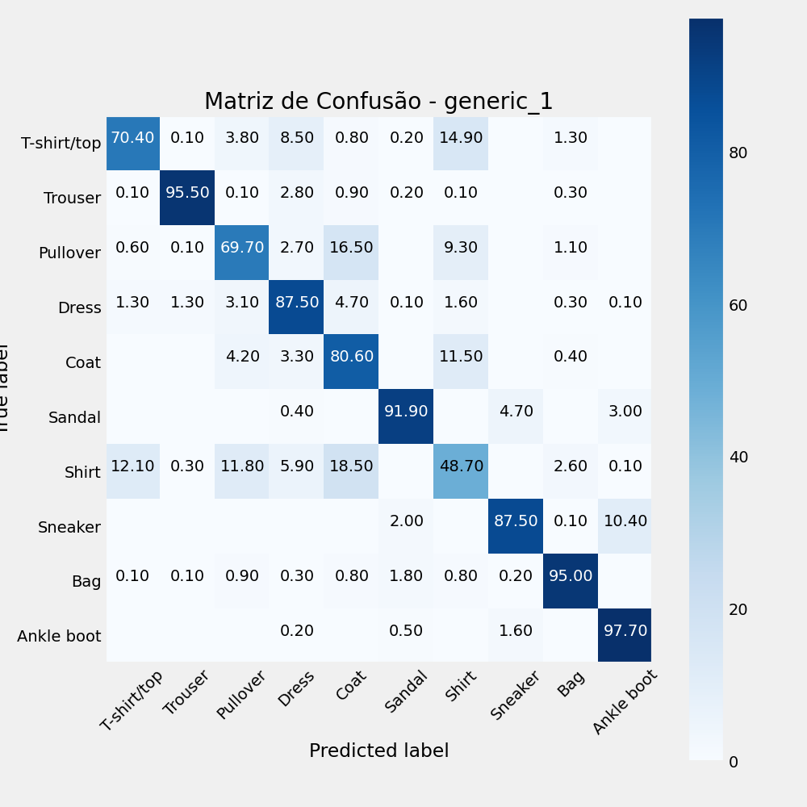 | 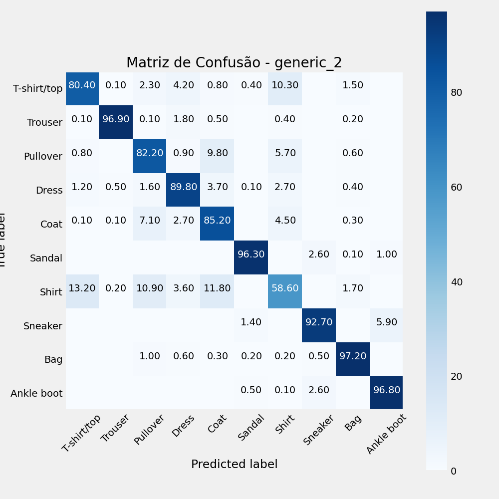 | 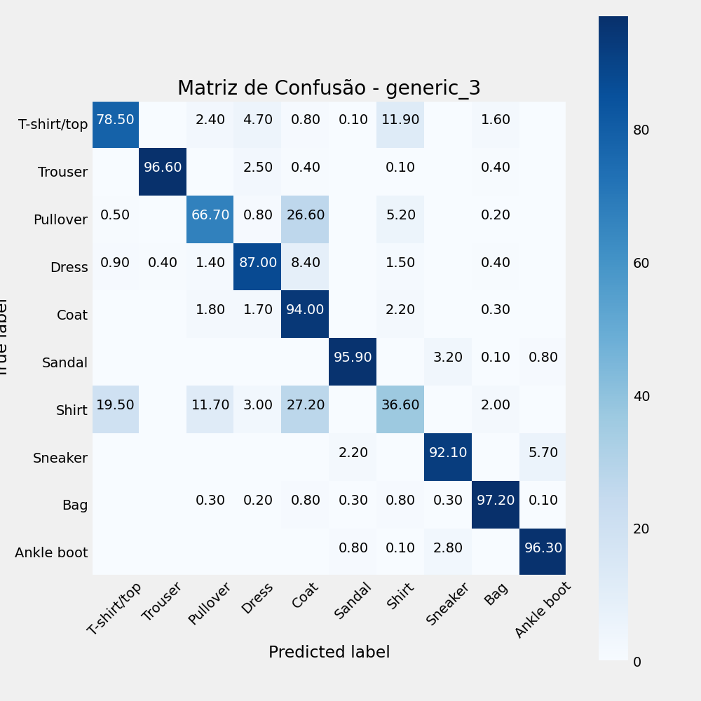 |

### Overall Performance Summary

| Model           | Architectural Group               | Accuracy   | Macro Avg F1-Score | Parameters |
| --------------- | --------------------------------- | ---------- | ------------------ | ---------- |
| **`generic_2`** | **Custom (Simpler)**              | **87.61%** | **0.8746**         | 11,854     |
| `generic_0`     | Baseline (`GerenicCNN` version)   | 85.27%     | 0.8505             | 7,090      |
| `cnn2_7`        | `n_feature` Variation (Wider)     | 84.96%     | 0.8475             | 9,828      |
| `generic_3`     | Custom (Deep Classifier)          | 84.09%     | 0.8354             | 2,955,014  |
| `cnn2_5`        | Base Model (`n_feature=5`)        | 83.28%     | 0.8296             | 7,090      |
| `generic_1`     | Deeper Featurizer (3 Conv Blocks) | 82.45%     | 0.8228             | 14,748     |
| `cnn2_3`        | `n_feature` Variation (Narrower)  | 80.41%     | 0.7998             | 4,424      |

The most surprising and insightful result is that the **simplest model, `generic_2`, was the best performer**. This indicates that for the 28x28 Fashion-MNIST images, one convolutional block is sufficient to extract the necessary features. Adding more complexity, either through deeper featurizers (`generic_1`) or vastly more complex classifiers (`generic_3`), did not yield better results and significantly increased the number of parameters.

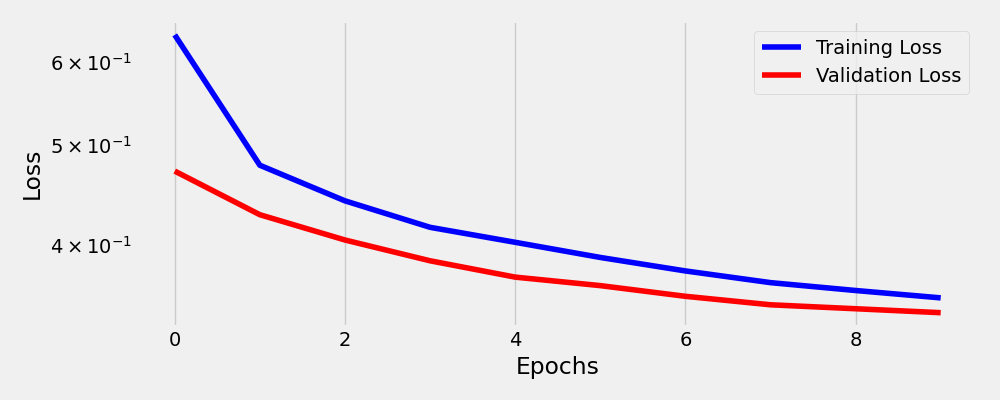

## Investigation with Hooks

As required by the assignment, PyTorch hooks were used to inspect the models' internal states during inference. The `ModelFlow` pipeline automatically attaches hooks to the convolutional layers to capture and save visualizations of the learned filters and their resulting activation maps.

### Learned Filters

The filters represent the patterns the convolutional layer learns to detect (e.g., edges, corners, textures). Below are the 4 filters learned by the single convolutional layer of our best model, `generic_2`.

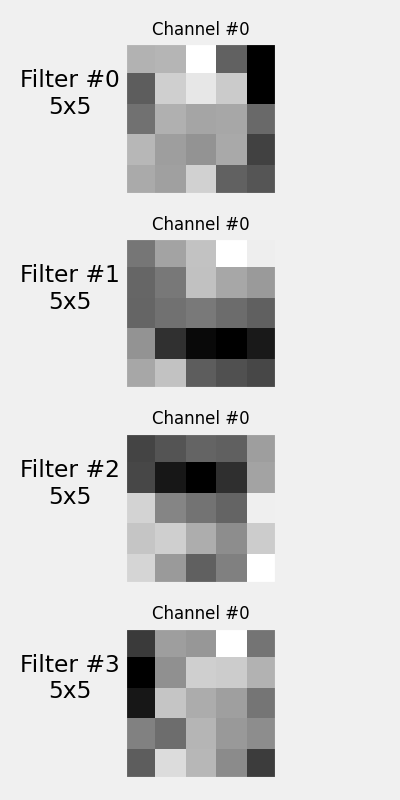

### Intermediate Activations

The activation maps show what parts of an input image are "activated" or emphasized by a given filter. This helps us understand what the model is "looking at." The image below shows the input images and the corresponding activation maps from the best model, `generic_2`.

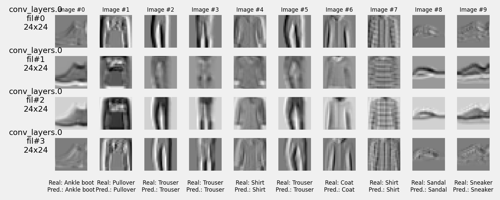


## Learning Rate Optimization

This second phase of the project focused on enhancing the training methodology by implementing a systematic process for finding the optimal **learning rate (LR)**. The goal was to replace the manual, trial-and-error approach from Part 1 with a more robust and automated technique.

### Implementation Process

The integration was accomplished in three main steps, building upon the existing framework.

1.  **Technique and Tooling**: The **LR Range Test** technique was adopted for this task. For a robust implementation, the `torch-lr-finder` library was integrated into the project, providing a well-tested version of the algorithm.

2.  **Integration into the `Architecture` Class**: A new method, `find_best_lr`, was added to the `Architecture` class. Its purpose is to encapsulate the entire LR finding logic. The key steps inside this method are:
    - Saving the initial state of the model and optimizer to prevent the destructive test from affecting the final training.
    - Instantiating `LRFinder` with the model's current components.
    - Running the `range_test` and automatically retrieving the suggested LR, which is based on the point of the steepest loss gradient.
    - Updating the instance's optimizer with this newly found learning rate.

    ```python
    # Key logic within the Architecture.find_best_lr method
    def find_best_lr(self, data_loader, end_lr=1, num_iter=100, set_lr=True):
        # --- Save model and optimizer states ---
        model_checkpoint = deepcopy(self.model.state_dict())
        optimizer_checkpoint = deepcopy(self.optimizer.state_dict())

        # --- Instantiate finder and run the test ---
        lr_finder = LRFinder(self.model, self.optimizer, self.loss_fn, device=self.device)
        lr_finder.range_test(data_loader, end_lr=end_lr, num_iter=num_iter)
        ax, best_lr = lr_finder.plot(log_lr=True, suggest_lr=True)

        # --- Restore original states ---
        self.model.load_state_dict(model_checkpoint)
        self.optimizer.load_state_dict(optimizer_checkpoint)

        # --- Update the optimizer with the found LR ---
        if set_lr:
            self.optimizer.param_groups[0]['lr'] = best_lr

        return ax, best_lr
    ```

3.  **Automation in the `ModelFlow` Pipeline**: The `ModelFlow` class was updated to automate this process. A new boolean parameter, `find_best_lr`, was added to its constructor. When set to `True`, the pipeline automatically executes the `find_best_lr` method during initialization and saves the resulting plot as a training artifact.

    ```python
    # Example of the automated workflow
    mflow = ModelFlow(
        model=test_new_model,
        train_loader=train_loader,
        val_loader=val_loader,
        model_name='test_new_model',
        find_best_lr=True  # This flag triggers the automated LR search
    )
    ```

### Results and Analysis

The automated LR finding process was applied to the best-performing architecture from Part 1, `generic_2`.

#### LR Finder Result

The LR Range Test suggested an optimal learning rate of approximately **4.86e-03**, as shown by the red dot at the point of the steepest gradient in the plot below.

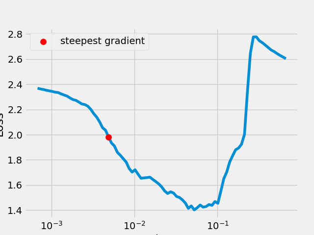

#### Training with Optimized LR

The model was subsequently trained for 10 epochs using this systematically chosen learning rate. Unfortunately, despite the more methodical approach, the final validation accuracy achieved was **86.33%**. This result did not surpass the best accuracy of **87.61%** obtained in Part 1 with a manually set LR.

This suggests that for this specific architecture and dataset, the original manually-tuned LR was already close to an optimal value. While the automated process provides a more robust and reproducible methodology, it did not yield a direct performance improvement in this particular case.

|           Loss Curve for `test_new_model`           |        Confusion Matrix for `test_new_model`        |
| :-------------------------------------------------: | :---------------------------------------------------: |
| 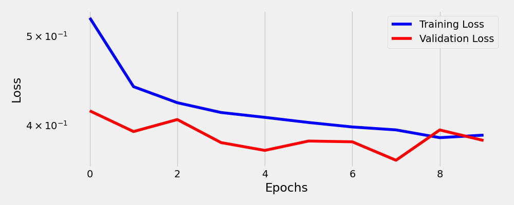 |  |


## Reproducibility

The entire experimental process is contained within the `tarefa-1.ipynb` notebook. The code is structured to be fully reproducible:

- **Execution**: Running the notebooks from top to bottom will train all models sequentially.
- **Output**: All artifacts—including metric reports (`.csv`), plots (`.png`), and model checkpoints (`.pth`)—are automatically saved into the `results/` directory, with a dedicated subfolder for each model.
- **Random Seed**: A fixed random seed (`42`) is used during training to ensure deterministic weight initialization and data shuffling, making the results consistent across runs.